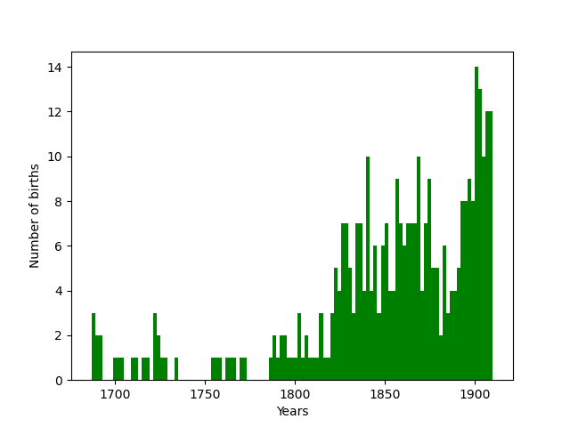

# GenealogyStats
Genealogy data from Jany family throughout centuries visualiser

Jany family is one of the oldest family in Naklo, small village in Silesia. 
Its history starts from XVII century, with first recorded birth. Research which has been made succesfully connected almost 
all members of this family bron in Żyglin parish from XVI century do the beginning of XX c..

This short piece of code is provided for visualisation how many births took place in diffrent years, and ho these births are ditrubited by month.

Year distribution:

Month distribution:

